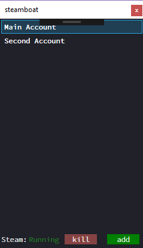
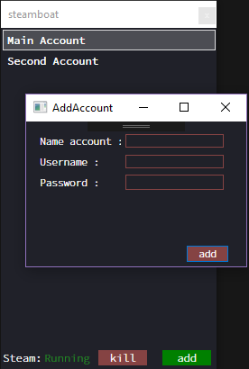

# Steam account switcher

Tool for switching between steam accounts easily. 

The accounts is store in a local SQLite database with passwords encrypted. 

## Platform Support

Built with C# 6 features, you must be running VS 2015 or VS 2017 to compile.

Built with WPF and SQLite with support for

|Platform|Version|
| ------------------- | :------------------: |
|Windows 7 UWP|10+|
|Windows 8.1 UWP|10+|
|Windows 10 UWP|10+|

## How to use

To Login with any account you should double clicked selected account. It's will be open steam app and login automatically.

To add an account you should clicked "Add Account" and write your data.

>To Edit or Remove any account you should click left to selected account and select Edit/Remove option

## Disclamer

> ### Steam account switcher does not send or store the accounts in another repository. All accounts saved with this app are stored in a local database.

## License
Licensed under MIT, see [LICENSE](LICENSE) file

